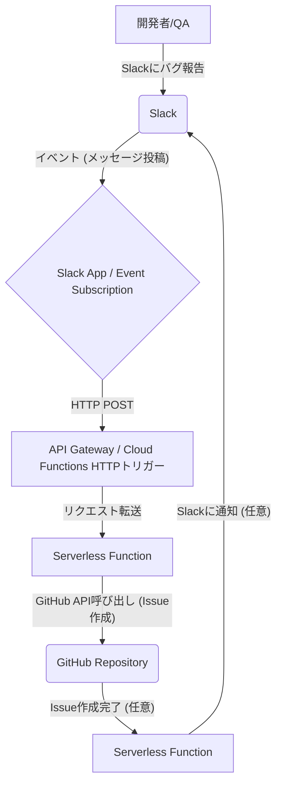

---

# slagit-bug-reporter

## SlackからGitHub Issueへバグ報告を自動化

`slagit-bug-reporter` は、Slackに投稿されたバグ報告メッセージを自動的に検知し、GitHubリポジトリに新しいIssueとして登録するシステムです。開発チームがバグ報告を効率的に管理し、迅速な対応を可能にすることを目指します。

## 🚀 導入のメリット

* **報告フローの簡素化**: 開発者やQAチームが普段利用しているSlackから直接バグ報告ができるため、報告の手間が削減されます。
* **情報の一元管理**: Slack上の散逸しがちなバグ情報をGitHub Issueとして集約し、管理しやすくします。
* **対応漏れの防止**: 報告されたバグが自動的にIssue化されるため、対応漏れのリスクを低減します。
* **トレーサビリティの向上**: Slackでの議論とGitHub Issueが連携され、バグ発生から解決までの経緯を追跡しやすくなります。

## 🛠️ システムアーキテクチャ

本システムは、低コストで運用できるよう**サーバーレスアーキテクチャ**を採用しています。



1.  **Slack**: バグ報告が行われる場所です。特定のチャンネルやスラッシュコマンドを通じてメッセージが投稿されます。
2.  **Slack App / Event Subscription**: Slackからのメッセージ投稿イベントを検知し、設定されたエンドポイント（Serverless Function）へHTTP POSTを送信します。
3.  **API Gateway / Cloud Functions HTTPトリガー**: SlackからのHTTP POSTリクエストを受け付ける公開エンドポイントとして機能します。
4.  **Serverless Function**: バグ報告のコアロジックを担う部分です。
    * SlackからのJSONデータを解析し、GitHub Issueのタイトルと本文を抽出・整形します。
    * GitHub APIを呼び出し、新しいIssueを作成します。
    * 必要に応じて、Issue作成完了をSlackに通知します。
5.  **GitHub Repository**: 作成されたIssueが登録されるGitHubのリポジトリです。

## ⚙️ セットアップ手順

### 1. GitHub パーソナルアクセストークン (PAT) の取得

GitHub Issueを作成するために、`repo` スコープを持つ**パーソナルアクセストークン**を生成してください。

### 2. Slack App の作成と設定

1.  [Slack API](https://api.slack.com/apps) で新しいSlack Appを作成します。
2.  **Features > Event Subscriptions** を有効にし、以下を設定します。
    * Request URL: 後述のServerless FunctionのエンドポイントURLを設定します。
    * Subscribe to bot events: `message.channels` や `app_mention` など、バグ報告を検知したいイベントを追加します。
3.  **Features > OAuth & Permissions** にて、`channels:read`, `chat:write` などの適切なスコープを付与します。
4.  Appをワークスペースにインストールし、必要なチャンネルに追加します。

### 3. AWS リソースの準備

#### 3.1 AWS Secrets Manager の設定

GitHub PATを安全に保存するためのシークレットを作成します：

```bash
# JSON形式で保存する場合
aws secretsmanager create-secret \
  --name "slagit-bug-reporter/github_pat" \
  --description "GitHub Personal Access Token for slagit-bug-reporter" \
  --secret-string '{"github_pat":"your-github-pat-here"}'

# プレーンテキストで保存する場合
aws secretsmanager create-secret \
  --name "slagit-bug-reporter/github_pat" \
  --description "GitHub Personal Access Token for slagit-bug-reporter" \
  --secret-string "your-github-pat-here"
```

#### 3.2 S3バケットの作成

デプロイパッケージ用のS3バケットを作成します：

```bash
aws s3 mb s3://your-deployment-bucket-name
```

#### 3.3 IAMロールの作成

Lambda関数用のIAMロールを作成し、以下の権限を付与します：

- `secretsmanager:GetSecretValue` (特定のシークレットのみ)
- `logs:CreateLogGroup`, `logs:CreateLogStream`, `logs:PutLogEvents`

### 4. GitHub Actions の設定

#### 4.1 GitHub Secrets の設定

リポジトリの Settings > Secrets and variables > Actions で以下のシークレットを設定してください：

**AWS認証情報:**
- `AWS_ACCESS_KEY_ID`: AWSアクセスキーID
- `AWS_SECRET_ACCESS_KEY`: AWSシークレットアクセスキー
- `AWS_REGION`: AWSリージョン（例: us-east-1）

**Lambda設定:**
- `LAMBDA_FUNCTION_NAME`: Lambda関数名（例: slagit-bug-reporter-function）
- `LAMBDA_HANDLER`: ハンドラーパス（例: lambda_function.lambda_handler）
- `LAMBDA_RUNTIME`: ランタイム（例: python3.9）
- `LAMBDA_ROLE_ARN`: IAMロールのARN

**デプロイ設定:**
- `S3_BUCKET_FOR_DEPLOYMENT`: デプロイパッケージ用S3バケット名

**アプリケーション設定:**
- `GITHUB_PAT_SECRET_NAME`: Secrets Managerのシークレット名（例: slagit-bug-reporter/github_pat）
- `GITHUB_REPO_OWNER`: GitHubリポジトリのオーナー名
- `GITHUB_REPO_NAME`: GitHubリポジトリ名
- `SLACK_WEBHOOK_URL`: Slack通知用Webhook URL（任意）

#### 4.2 デプロイの実行

`main` ブランチにプッシュすると、自動的にGitHub Actionsが実行され、Lambda関数がデプロイされます。

### 5. テスト

設定完了後、Slackの対象チャンネルでバグ報告メッセージを投稿し、GitHubにIssueが自動作成されることを確認してください。

## 📝 GitHub Issueのフォーマット

`slagit-bug-reporter` は、Slackメッセージの内容から以下のフォーマットでGitHub Issueを生成することを想定しています。

### タイトル

`[Bug] [影響範囲] 問題の要約`

**例**: `[Bug] [UI/ログイン画面] パスワード再設定時にエラーが発生する`

### 本文

```markdown
## 問題の要約

(タイトルの詳細な説明)

## 再現手順

1. (ステップ1)
2. (ステップ2)
3. ...

### 環境
- OS:
- ブラウザ:
- バージョン:

## 期待される動作

(こうあるべきという動作)

## 実際の動作

(実際に起こる現象。エラーメッセージ、スクリーンショットなど)

## 技術情報/追加情報

(エラーログ、関連する試み、その他参考情報)
```

**ヒント**: Slackでのバグ報告時に、上記のような構成で情報を記述するようチーム内でガイドラインを設けると、より質の高いIssueが生成されます。

## 🔧 ローカル開発

### 依存関係のインストール

```bash
pip install -r src/requirements.txt
```

### デプロイパッケージの作成

```bash
python scripts/deploy_lambda.py \
  --source src \
  --requirements src/requirements.txt \
  --output artifact/lambda_package.zip
```

## 📁 ディレクトリ構成

```
.
├── .github/
│   └── workflows/
│       └── deploy.yml          # GitHub Actions デプロイワークフロー
├── src/
│   ├── lambda_function.py      # Lambda関数本体
│   └── requirements.txt        # Python依存関係
├── scripts/
│   └── deploy_lambda.py        # Lambdaデプロイパッケージ作成スクリプト
├── prompts/
│   └── cursor_spec_prompt.md   # 仕様書
└── README.md                   # このファイル
```

## 🤝 貢献

プルリクエストやイシューの報告を歓迎します。大きな変更を行う場合は、まずイシューで議論してください。

## 📄 ライセンス

このプロジェクトはMITライセンスの下で公開されています。
