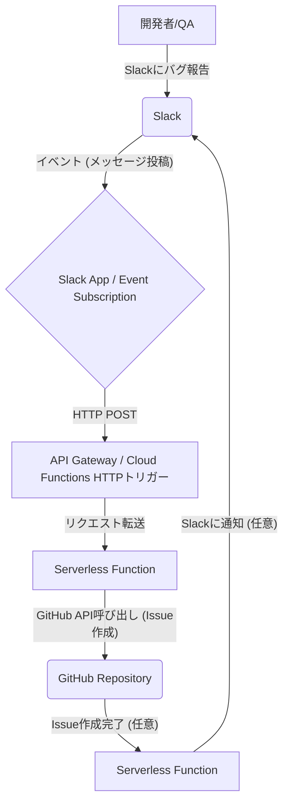

---

# slagit-bug-reporter

## SlackからGitHub Issueへバグ報告を自動化

`slagit-bug-reporter` は、Slackに投稿されたバグ報告メッセージを自動的に検知し、GitHubリポジトリに新しいIssueとして登録するシステムです。開発チームがバグ報告を効率的に管理し、迅速な対応を可能にすることを目指します。

## 🚀 導入のメリット

* **報告フローの簡素化**: 開発者やQAチームが普段利用しているSlackから直接バグ報告ができるため、報告の手間が削減されます。
* **情報の一元管理**: Slack上の散逸しがちなバグ情報をGitHub Issueとして集約し、管理しやすくします。
* **対応漏れの防止**: 報告されたバグが自動的にIssue化されるため、対応漏れのリスクを低減します。
* **トレーサビリティの向上**: Slackでの議論とGitHub Issueが連携され、バグ発生から解決までの経緯を追跡しやすくなります。

## 🛠️ システムアーキテクチャ

本システムは、低コストで運用できるよう**サーバーレスアーキテクチャ**を採用しています。



1.  **Slack**: バグ報告が行われる場所です。特定のチャンネルやスラッシュコマンドを通じてメッセージが投稿されます。
2.  **Slack App / Event Subscription**: Slackからのメッセージ投稿イベントを検知し、設定されたエンドポイント（Serverless Function）へHTTP POSTを送信します。
3.  **API Gateway / Cloud Functions HTTPトリガー**: SlackからのHTTP POSTリクエストを受け付ける公開エンドポイントとして機能します。
4.  **Serverless Function**: バグ報告のコアロジックを担う部分です。
    * SlackからのJSONデータを解析し、GitHub Issueのタイトルと本文を抽出・整形します。
    * GitHub APIを呼び出し、新しいIssueを作成します。
    * 必要に応じて、Issue作成完了をSlackに通知します。
5.  **GitHub Repository**: 作成されたIssueが登録されるGitHubのリポジトリです。

## ⚙️ セットアップ手順

詳細なセットアップ手順は、各クラウドプロバイダー（AWS, GCP, Azure）ごとのドキュメントまたは以下のセクションを参照してください。

### 1. GitHub パーソナルアクセストークン (PAT) の取得

GitHub Issueを作成するために、`repo` スコープを持つ**パーソナルアクセストークン**を生成してください。

### 2. Slack App の作成と設定

1.  [Slack API](https://api.slack.com/apps) で新しいSlack Appを作成します。
2.  **Features > Event Subscriptions** を有効にし、以下を設定します。
    * Request URL: 後述のServerless FunctionのエンドポイントURLを設定します。
    * Subscribe to bot events: `message.channels` や `app_mention` など、バグ報告を検知したいイベントを追加します。
3.  **Features > OAuth & Permissions** にて、`channels:read`, `chat:write` などの適切なスコープを付与します。
4.  Appをワークスペースにインストールし、必要なチャンネルに追加します。

### 3. Serverless Function のデプロイ

選択したクラウドプロバイダー（AWS Lambda）に、本リポジトリのコードをデプロイします。

* **環境変数**: 取得したGitHub PATをセキュアな方法（例: AWS Secrets Manager）で設定し、Function内で利用できるようにします。
* **コードのデプロイ**: 本リポジトリのFunctionコードをデプロイします。コードはSlackからのWebhookペイロードを解析し、GitHub APIを呼び出すロジックを含みます。

### 4. テスト

設定完了後、Slackの対象チャンネルでバグ報告メッセージを投稿し、GitHubにIssueが自動作成されることを確認してください。

## 📝 GitHub Issueのフォーマット

`slagit-bug-reporter` は、Slackメッセージの内容から以下のフォーマットでGitHub Issueを生成することを想定しています。

### タイトル

`[Bug] [影響範囲] 問題の要約`

**例**: `[Bug] [UI/ログイン画面] パスワード再設定時にエラーが発生する`

### 本文

```markdown
## 問題の要約

(タイトルの詳細な説明)

## 再現手順

1. (ステップ1)
2. (ステップ2)
3. ...

### 環境
- OS:
- ブラウザ:
- バージョン:

## 期待される動作

(こうあるべきという動作)

## 実際の動作

(実際に起こる現象。エラーメッセージ、スクリーンショットなど)

## 技術情報/追加情報

(エラーログ、関連する試み、その他参考情報)
```

**ヒント**: Slackでのバグ報告時に、上記のような構成で情報を記述するようチーム内でガイドラインを設けると、より質の高いIssueが生成されます。
